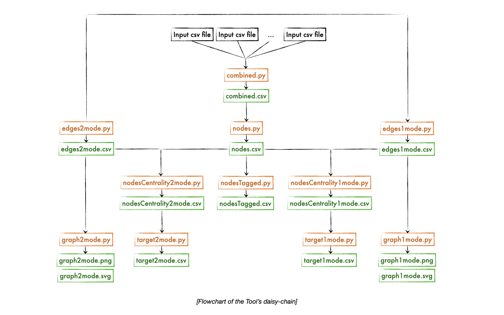

---

_**Disclaimer:** This project was done as part of my work with Anthemis. All data shown in this repository are dummy datasets and were not intended to reflect the networks of any VC communities in reality._

## Introduction

**The Venture Capital Fundraising Tool was inspired by the unobvious impacts that networks have on business outcomes.**  When fundraising, venture capitalists struggle to identify key investors in an objective fashion, it is common practice for VCs to focus on investors/coinvestors they already know, rather than the ones that they should know. Even so, identifying the ones that they should know is proven to be a challenge, as assessing the _"should"_ factor can be subjected to one's personal biases or lack of information. Hence, we believe that the networks of VCs play a more crucial role in fundraising outcomes than most choose to believe and that network analysis can  complement current VC fundraising workflows.


## The Tool


The Tool is made up of a series of Python scripts daisy-chained together, with the outputs of one script serving as the input to the next script. It is then run using a Shell script in Terminal, where a simple "How to Use" guide would be echoed. Daisy-chaining the scripts (instead of executing one large script) allows the user to be able to examine the inputs/outputs at each stage of the Tool to get a better intuition of its final recommendations. Additionally, changes can be made to any one part of the process without affecting the rest, allowing for greater flexibility during maintenance of the Tool. The figure below shows the skeleton of the Tool.



## The Inputs

The original dataset used was acquired from [PitchBook](www.pitchbook.com).


## The Outputs

The output is a csv file that force ranks potential limited partners based on the VC network stitched from the input csv files. Specifically, they are ranked based on a weighted sum of network centrality measures. The code provided by this repo uses degree centrality, eigenvector centrality and reach centrality, but other centrality measures can be added/removed too. We believe that these measures capture relationships or even causal effects on the fundraising outcomes that are not-so-obvious to the human intuition. As such, using this Tool can provide an objective method of identifying potential limited partners that complements the current VC fundraising workflows.

## Getting Started

### Local
All required pacakges can be found in the `requirements.txt` file. To install the packages, run

```python
pip install -r requirements.txt
```


## Special Thanks

This project would not have been possible without the boldness of the Anthemis team to challenge the conventional and their openness to new ideas. This project was mentored by Erica Young.
